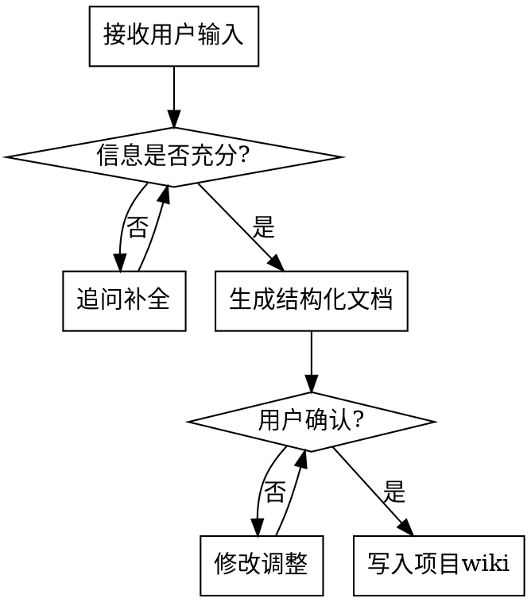

# 业务背景对齐

将模糊的"提高业绩"锁定为一个有明确目标、有清晰边界、有可行动作空间的结构化问题定义。

核心原则：**所有输出必须经用户确认，绝不自行编造或擅自修改。**

---

## 触发条件

- 新项目启动，需要定义业务问题
- 下游 skill（策略库、策略优化等）运行时发现缺少前置文件
- 用户要求更新业务背景（目标变化、战略调整等）

---

## 工作流程



---

## 第一步：信息收集

通过对话引导或用户提供的文档（markdown），明确以下要素。信息不足时**必须追问**，不能跳步或假设。

### 1.1 业务目标

明确核心业务目标。实际业务不是单目标，常见维度：规模、质量、效率、体验、风险。

需要确定：
- 哪个维度作为**优化目标**（如规模最大化）
- 其他维度作为**围栏约束**

### 1.2 指标体系

将目标和约束转化为可量化的指标体系：

| 类型 | 说明 | 需明确内容 |
|------|------|-----------|
| 目标指标 | 衡量核心目标的指标 | 指标名称、计算公式、目标值 |
| 围栏指标 | 不能突破的约束 | 指标名称、计算公式、阈值（≥或≤） |
| 过程指标 | 解释目标变化原因 | 指标名称、计算公式 |
| 外部环境指标 | 反映供需/竞争等外部条件 | 指标名称、计算公式、数据来源 |

### 1.2.1 外部环境指标的确认（必须显式追问）

外部环境指标**不能由 Agent 自行编造或默认填充**，必须：

1. **主动追问用户**："哪些外部因素会影响策略效果？"
2. **提供引导选项**帮助用户思考：如大盘流量水位、竞价水平、季节性、促销档期、竞品动作等
3. **允许为空**：如果用户明确表示没有或暂时不考虑，记录为"无外部环境指标"并写入 metrics.md
4. **不能跳过**：即使用户未主动提及，也必须追问一次

外部环境指标为空时的影响（需告知用户）：
- 策略效果筛选将退化为"按时间最近"
- 置信度分层将退化为"按执行次数 + 时间远近"

### 1.3 围栏约束

将非目标维度转化为明确的硬约束：

- 效率约束：如 ROI ≥ X、CAC ≤ Y
- 质量约束：如单用户 GMV ≥ Z
- 预算约束：如总投入 ≤ W
- 其他合规/风险约束

### 1.4 能力约束（策略动作空间）

明确可以在什么范围内做策略：

- **差异化颗粒度**：能否分人群/分时/分地域，精细到什么程度
- **可选动作集**：有哪些可操作的选项
- **执行限制**：人力/系统决定的策略调整频率和响应速度

### 1.5 重点动作导向

上层战略意图对本项目的方向约束：

- 在更大层面目标下，本项目/业务优先在什么方向上带来增长或改善
- 明确方向性要求（如"优先做下沉市场"、"优先提升复购而非拉新"）

---

## 第二步：结构化输出

信息充分后，生成结构化文档，**必须逐条向用户确认**。

### 输出文件结构

```
{项目名}/wiki/
├── index.md                ← 索引，全局入口
├── overview.md             ← 完整业务背景（人读）
├── metrics.md              ← 指标体系（目标+围栏+过程+环境）
├── constraints.md          ← 能力约束（动作空间）
├── strategic-direction.md  ← 重点动作导向
└── log.md                  ← 变更记录
```

### 各文件职责

**index.md**：列出所有子文档及一句话摘要，供下游 skill 快速定位。

**overview.md**：完整业务背景的人可读文档，包含所有要素的完整描述，适合通读理解全局。

**metrics.md**：结构化的指标体系，格式需兼顾人可读和 skill 可解析：

```markdown
## 目标指标
| 指标名称 | 计算公式 | 目标值 | 说明 |
|---------|---------|--------|------|

## 围栏指标
| 指标名称 | 计算公式 | 阈值 | 约束方向 | 说明 |
|---------|---------|------|---------|------|

## 过程指标
| 指标名称 | 计算公式 | 说明 |
|---------|---------|------|

## 外部环境指标
| 指标名称 | 计算公式 | 数据来源 | 说明 |
|---------|---------|---------|------|
```

**constraints.md**：能力约束的结构化描述：

```markdown
## 差异化颗粒度
| 维度 | 是否可差异化 | 最小颗粒度 | 说明 |
|------|------------|-----------|------|

## 可选动作集
| 动作类型 | 可选项 | 说明 |
|---------|--------|------|

## 执行限制
| 限制类型 | 具体限制 | 说明 |
|---------|---------|------|
```

**strategic-direction.md**：重点动作导向的描述。

**log.md**：append-only 变更记录，每次修改记录时间、修改内容、修改原因。

---

## 第三步：确认与写入

1. 将生成的每份文档内容展示给用户
2. 逐一确认，用户要求修改则调整后再次确认
3. 全部确认后写入项目 wiki 目录
4. 在 log.md 中记录创建事件

---

## 持续迭代模式

首次创建后，后续业务推进中可能需要更新：

1. 用户提出变更需求或在对话中提供新信息
2. skill 生成修改建议（标注修改点和原因）
3. **必须经用户确认后才写入**
4. 更新 log.md 记录变更

---

## 追问原则

- 目标不明确 → 询问："核心目标是什么维度？规模/效率/质量？"
- 指标缺公式 → 询问："这个指标的计算公式是什么？"
- 阈值不明确 → 询问："围栏指标的底线值是多少？"
- 能力边界不清 → 询问："目前系统/人力支持到什么颗粒度的差异化？"
- 方向不明 → 询问："上层对这个项目的重点期望方向是什么？"

---

## 铁律

1. **不编造**：所有内容来自用户输入或用户提供的文档，绝不自行推测填充
2. **必确认**：每一项输出都需用户确认后才写入文件
3. **不跳步**：信息不足时必须追问，不能假设或跳过
4. **不硬编码业务细节**：skill 内容不包含任何具体业务场景的硬编码（如"人群""渠道"等词），统一引用用户对齐后的配置
