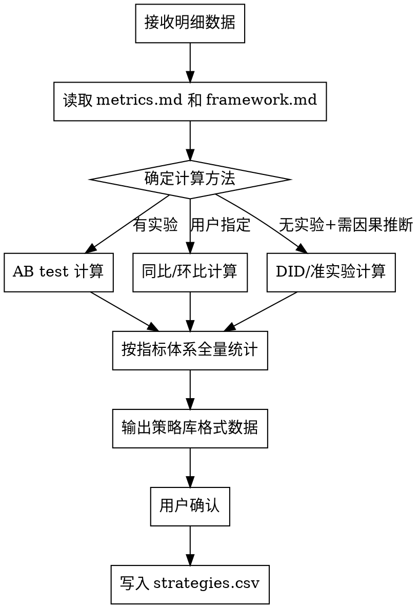

# 效果评估

将原始明细数据加工成策略库格式的效果数据。本质是策略库的**数据供给者**——按照指标体系，将明细数据统计计算为每个策略的结构化效果值。

核心原则：**按照项目指标体系全量计算，方法由数据条件决定。**

---

## 触发条件

- 周期性执行（如每周）
- 用户要求做策略优化前，先更新效果数据
- 新一批策略执行数据到位
- 用户主动要求评估某批策略效果

---

## 前置依赖

- `{项目名}/wiki/metrics.md` — 指标体系定义（决定计算哪些指标）
- `{项目名}/strategy-library/framework.md` — 策略框架（决定按什么维度聚合）
- `{项目名}/strategy-library/strategies.csv` — 已有策略库（输出目的地）

如前置文件不存在，提示用户先完成对应步骤。

---

## 工作流程



---

## 计算方法

根据数据条件选择：

### 方法一：AB Test

有实验组和对照组时使用。

```python
import pandas as pd
import numpy as np

# 读取实验数据
df = pd.read_csv("experiment_data.csv", encoding='utf-8-sig')

# 分组计算
treatment = df[df['group'] == 'treatment']
control = df[df['group'] == 'control']

# 计算增量效果
effect = treatment['metric'].mean() - control['metric'].mean()
# 统计显著性检验
from scipy import stats
t_stat, p_value = stats.ttest_ind(treatment['metric'], control['metric'])
```

### 方法二：同比/环比

无实验时，基于时间对比。

```python
# 环比
current_period = df[df['period'] == 'current']
previous_period = df[df['period'] == 'previous']
mom_change = current_period['metric'].sum() - previous_period['metric'].sum()

# 同比
same_period_last_year = df[df['period'] == 'yoy_base']
yoy_change = current_period['metric'].sum() - same_period_last_year['metric'].sum()
```

### 方法三：DID（双重差分）

无实验但有对照参考时。

```python
# DID = (处理组后 - 处理组前) - (对照组后 - 对照组前)
did_effect = (treat_after - treat_before) - (control_after - control_before)
```

方法选择由用户指定或根据数据条件判断。

---

## 计算范围

按 `metrics.md` 中定义的**完整指标体系**统计：

| 指标类型 | 计算内容 |
|---------|---------|
| 目标指标 | 策略带来的效果值（如增量 GMV、增量用户数） |
| 围栏指标 | 效率/质量指标值（如 ROI、CAC） |
| 过程指标 | 中间环节表现（如转化率、点击率） |
| 外部环境指标 | 当期环境状态值（如价格竞争力） |

---

## 输出格式

输出结果按 strategies.csv 的列结构生成，可直接追加写入：

```
策略ID, {要素维度1}, ..., {要素维度N}, 执行开始时间, 执行结束时间, {目标指标}, {围栏指标1}, ..., {过程指标1}, ..., {环境指标1}, ..., 数据来源, 置信度
```

- 数据来源：标注使用的计算方法（AB test / 同比 / 环比 / DID）
- 置信度：AB test = 高；同比环比 = 中；数据不足 = 低

---

## 输入

- **明细数据**：数据库查询结果、Excel/CSV 文件
- **指标体系定义**：从 wiki/metrics.md 读取
- **策略明细信息**：哪个策略在什么时间段执行（从用户提供或从数据中解析）

---

## 铁律

1. **全量计算**：按指标体系中所有指标统计，不遗漏
2. **方法透明**：标注每个效果值使用的计算方法
3. **用户确认**：计算结果经用户确认后才写入策略库
4. **不硬编码**：指标名称、维度名称全部从配置文件读取
