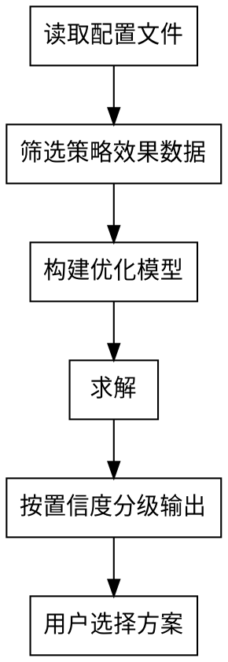

# 策略优化

基于业务目标和约束，结合策略库中的策略效果数据（含实测和拟合），通过整数规划算法求解最优策略组合。

核心原则：**输出按置信度分级的多版本方案，让用户基于风险偏好选择。**

---

## 触发条件

- 用户要求制定最优策略方案
- 定期策略更新周期到来
- 业务目标/约束发生变化需要重新优化

---

## 前置依赖

运行本 skill 前，检查以下文件是否存在：

- `{项目名}/wiki/metrics.md` — 指标体系（目标函数和约束）
- `{项目名}/wiki/constraints.md` — 能力约束
- `{项目名}/strategy-library/framework.md` — 策略框架
- `{项目名}/strategy-library/strategies.csv` — 策略效果数据
- `{项目名}/strategy-library/mutual-exclusion.md` — 互斥关系

**如有缺失，不要生硬提示"请先运行XX skill"。** 应自然地向用户收集所需信息：
- 询问用户的业务目标、约束条件、策略维度等基础信息
- 询问是否有现成的项目文档或数据文件可以提供
- 在对话中收集到足够信息后，内部自动完成前置文件的生成（经用户确认）
- 让用户感受到的是"一个连贯的对话"，而非"被系统挡在门外"

---

## 问题本质

**带约束的组合优化 / 0-1 整数线性规划**：从 N 个离散策略中，选出最优子集，在约束下使目标最大化。

关键认知：
- 策略是离散的有限组合（各要素维度的值交叉）
- 资源/投入规模是策略的一个要素维度（不同投入规模 = 不同策略）
- 维度多时策略组合数量爆炸，必须通过算法求解

---

## 工作流程



### Step 1：读取输入

从共享文件中读取：

| 输入 | 来源文件 | 内容 |
|------|---------|------|
| 目标函数 | wiki/metrics.md | 目标指标（最大化/最小化哪个指标） |
| 约束条件 | wiki/metrics.md | 围栏指标及其阈值 |
| 策略效果 | strategy-library/strategies.csv | 每个策略的效果值和置信度 |
| 互斥关系 | strategy-library/mutual-exclusion.md | 不能同时选的策略对 |
| 外部环境 | 用户提供（非必须） | 用于筛选匹配的效果记录 |

### Step 2：筛选策略效果数据

从 strategies.csv 中为每个策略选取一条效果记录：
- 优先选外部环境匹配的记录
- 其次选最近一次的效果数据
- 如无外部环境输入，默认使用最近记录

用 Python 读取和筛选：

```python
import pandas as pd

df = pd.read_csv("{项目名}/strategy-library/strategies.csv", encoding='utf-8-sig')
# 按外部环境匹配或时间最近筛选每个策略的效果值
```

### Step 3：构建优化模型

将业务问题转化为数学规划：

```python
from pulp import *

prob = LpProblem("策略优化", LpMaximize)

# 决策变量：每个策略选或不选
x = {k: LpVariable(f"策略_{k}", cat='Binary') for k in strategies}

# 目标函数：从 metrics.md 读取的目标指标最大化
prob += lpSum(x[k] * effect[k] for k in strategies)

# 约束1：预算/资源总量
prob += lpSum(x[k] * cost[k] for k in strategies) <= total_budget

# 约束2：围栏指标（比率约束转线性）
# 例：ROI >= threshold  →  revenue - threshold * cost >= 0
prob += lpSum(x[k] * revenue[k] for k in strategies) - roi_threshold * lpSum(x[k] * cost[k] for k in strategies) >= 0

# 约束3：互斥关系
for a, b in mutual_exclusive_pairs:
    prob += x[a] + x[b] <= 1

prob.solve()
```

### Step 4：按置信度分级输出

对求解结果按策略的置信度分级，输出多版本方案：

| 方案版本 | 策略构成 | 特点 |
|---------|---------|------|
| 高置信方案 | 仅包含实测策略 | 效果确定性高，风险低 |
| 中置信方案 | 包含部分拟合策略 | 预期收益更高，有不确定性 |
| 高风险方案 | 包含较多未验证策略 | 潜在收益最大，风险最大 |

实现方式：对不同置信度子集分别求解，或对全集求解后按置信度分组展示。

---

## 输出格式

每个方案版本输出以下内容：

```markdown
## {方案版本名}

**预期效果**：{目标指标预估值}

### 策略明细

| 策略ID | {维度1} | {维度2} | ... | 预期效果 | 置信度 | 数据来源 |
|--------|---------|---------|-----|---------|--------|---------|

### 与当前策略对比

| 调整项 | 当前 | 建议 | 调整原因 |
|--------|------|------|---------|

### 风险说明
- 拟合策略占比：X%
- 低置信策略：列出具体哪些
- 建议验证方式：AB test / 小流量试跑
```

输出写入：`{项目名}/outputs/optimization-{日期}.md`

---

## 求解器选择

| 求解器 | 适用规模 | 说明 |
|--------|---------|------|
| PuLP（推荐） | 千级策略 | 开源、建模可读、零额外依赖 |
| scipy.optimize.milp | 百~千级 | 建模需写矩阵，可读性差 |
| OR-Tools | 万级 | 功能强，规模小时不必要 |
| Gurobi / CPLEX | 百万级 | 商业级，需付费 |

默认使用 PuLP。策略数量超过万级时考虑升级。

---

## 铁律

1. **多版本输出**：不输出单一"最优解"，必须按置信度分级
2. **可执行颗粒度**：每个方案必须具体到可直接执行的程度
3. **标注拟合来源**：每条策略必须标注是实测还是拟合及置信度
4. **不硬编码**：目标函数、约束条件、要素维度全部从配置文件读取
