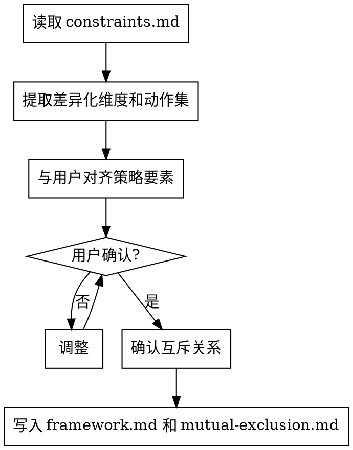
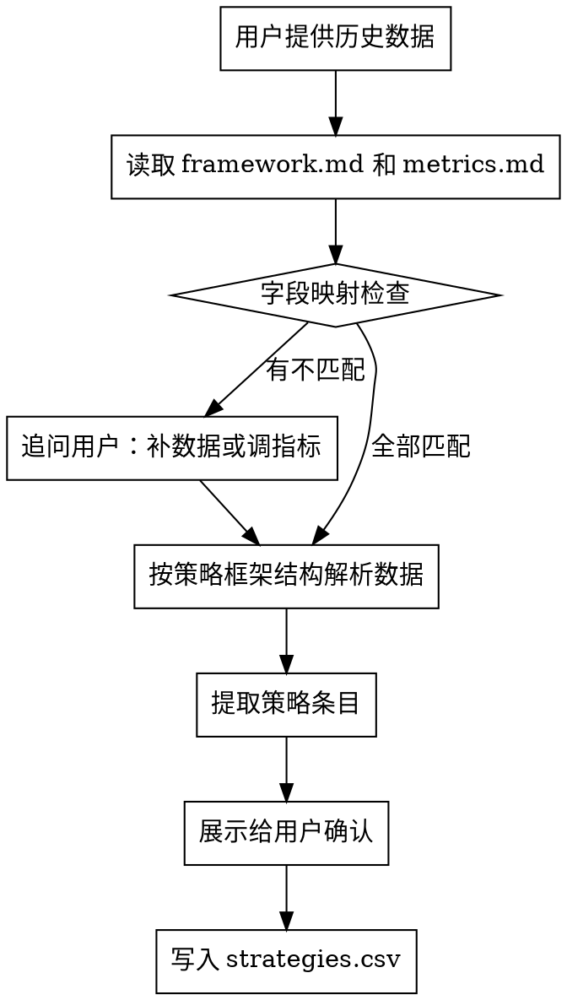

# 策略库

管理策略的结构化知识库。包含策略框架定义（策略由哪些要素构成）和策略效果记录（历史策略的实际表现）。

核心原则：**所有内容必须经用户确认，绝不自行编造或擅自修改。**

---

## 触发条件

- 新项目需要建立策略框架
- 需要从历史数据冷启动策略库
- 新策略执行后需要沉淀效果数据
- 下游 skill 需要策略数据但库为空或不完整
- 需要对未覆盖策略进行效果拟合
- 拟合策略获得真实数据后需要验证替换

---

## 前置依赖

运行本 skill 前，检查以下文件是否存在：

- `{项目名}/wiki/metrics.md` — 指标体系定义
- `{项目名}/wiki/constraints.md` — 能力约束定义

**如不存在，自动衔接调用 `business-context-alignment` skill：**
1. 调用 `business-context-alignment` skill 引导用户完成业务背景对齐
2. 前置 skill 完成后，自动回到策略库流程继续执行

对用户的体验应是连贯的对话流程，skill 之间的衔接对用户透明。

---

## 策略库的两层结构

### 第一层：策略框架

定义"一个策略由哪些要素组成"以及每个要素的可选值。

存储位置：`{项目名}/strategy-library/framework.md`

格式：

```markdown
## 策略要素维度

| 要素维度 | 可选值 | 说明 |
|---------|--------|------|
| {维度1} | {值1, 值2, 值3...} | {说明} |
| {维度2} | {值1, 值2, 值3...} | {说明} |
| ... | ... | ... |
```

**要素维度和可选值必须与用户沟通对齐确认。** 从 `constraints.md` 中的能力约束（差异化颗粒度、可选动作集）获取初始信息，再与用户确认完善。

### 第二层：策略效果

记录每个策略的执行效果数据。

存储位置：`{项目名}/strategy-library/strategies.csv`

CSV 列结构（根据项目指标体系动态生成）：

```
策略ID, {要素维度1}, {要素维度2}, ..., {要素维度N}, 执行开始时间, 执行结束时间, {目标指标}, {围栏指标1}, ..., {过程指标1}, ..., {环境指标1}, ..., 数据来源, 置信度
```

- **策略ID**：唯一标识
- **要素维度列**：该策略在每个维度上的具体值
- **指标列**：从 `metrics.md` 中读取所有指标，每个指标一列
- **执行时间**：策略实际执行的时间段
- **数据来源**：实测 / 拟合
- **置信度**：高 / 中 / 低（分层规则见下方）

### 置信度分层规则

置信度反映策略效果数据的可信程度，**分层依据需要与用户对齐**：

#### 第一步：确认外部环境指标（读取 metrics.md）

- 如果 `metrics.md` 中定义了外部环境指标 → 按**外部环境匹配度 × 执行次数**分层
- 如果外部环境指标为空 → 退化为**时间近远 × 执行次数**分层

#### 第二步：分层标准

**有外部环境指标时：**

| 置信度 | 条件 |
|--------|------|
| 高 | 实测 + 多次执行(≥3) + 外部环境匹配 |
| 中 | 实测 + 少次执行(1-2次) + 外部环境匹配；或多次执行但环境不完全匹配 |
| 低 | 外部环境不匹配；或拟合/插值数据 |

**外部环境指标为空时：**

| 置信度 | 条件 |
|--------|------|
| 高 | 实测 + 最近 N 周内 + 多次执行(≥3) |
| 中 | 实测 + 最近 N 周内 + 少次执行(1-2次)；或更早期的多次实测 |
| 低 | 仅有更早期单次实测；或拟合/插值数据 |

（N 默认为 3 周，可由用户在业务对齐时指定）

#### 第三步：拟合策略的置信度上限

通过插值/外推获得的策略效果，置信度**最高为"中"**：
- 相邻策略数据充分、外推距离近 → 中
- 相邻策略数据不足、外推距离远 → 低
- 即使相邻策略都是高置信实测数据，拟合结果也不能标为"高"

---

## 策略互斥关系

存储位置：`{项目名}/strategy-library/mutual-exclusion.md`

格式：

```markdown
## 互斥规则

| 规则ID | 互斥策略描述 | 互斥原因 | 约束表达 |
|--------|------------|---------|---------|
| 1 | {描述哪些策略不能同时选} | {原因} | {形式化表达，如 x_a + x_b <= 1} |
```

### 互斥关系确认流程（必须与用户确认）

互斥关系**不能由 Agent 自行假设**，必须按以下步骤执行：

1. Agent 基于数据特征和业务逻辑**提出互斥假设**
2. 向用户展示假设，并解释：
   - 互斥约束的业务含义（为什么这些策略不能同时选）
   - 约束过严的影响（减少可选空间，可能错过最优组合）
   - 约束过松的影响（可能选出实际无法同时执行的策略）
3. **等待用户确认或修改**后才写入 mutual-exclusion.md

追问模板：
```
我建议的互斥约束是：{描述}。
- 业务含义：{解释}
- 如果约束过严：{影响}
- 如果约束过松：{影响}
请确认是否合理，或提出调整？
```

---

## 工作流程

### 流程一：建立策略框架



### 流程二：冷启动填充



#### 字段映射检查（必须执行）

读取数据后，**必须立即**执行以下检查：

1. 从 `wiki/metrics.md` 读取所有已定义指标（目标+围栏+过程+外部环境）
2. 从实际数据文件读取所有列名
3. 逐一对比，列出匹配和不匹配的指标
4. **如有不匹配，必须向用户追问**，提供两个选择：

| 选项 | 说明 | 后续动作 |
|------|------|---------|
| 补充数据 | 用户提供缺失字段的数据或计算公式 | 按用户指示补充后继续 |
| 调整指标 | 用现有数据字段替代缺失指标 | 同步更新 wiki/metrics.md 和 wiki/log.md |

5. 如果数据中的维度名称与用户描述不一致（如用户说"抖音"但数据里是"信息流"），必须追问确认映射关系，并记录到 `wiki/constraints.md`

**禁止行为**：发现不匹配时默默跳过或自行假设映射关系。

关键原则：
- 数据不全没关系，有多少填多少
- 尽量从数据中提取，避免口述
- 即使用户口述，也必须落成策略框架的结构化格式

### 流程三：增量沉淀

被触发时（用户要求或定期执行），将新策略及效果写入 strategies.csv：

1. 接收新策略执行数据
2. 按 framework.md 结构解析
3. 按 metrics.md 指标体系计算效果值（或调用效果评估 skill）
4. 展示给用户确认
5. 追加写入 strategies.csv

### 流程四：策略拟合

对策略框架中存在但 strategies.csv 中无记录的策略组合，进行效果预估：

1. 识别未覆盖的策略空间（框架中的可能组合 - 已有记录）
2. 找到相邻已知策略（要素值接近的策略）
3. 基于相邻策略效果进行插值/外推
4. 输出拟合效果值 + 置信度 + 拟合依据
5. 写入 strategies.csv，数据来源标记为"拟合"

相邻策略定义：在某个要素维度上值接近的策略。例如已知 20-25 岁和 30-35 岁效果，可拟合 25-30 岁效果。

### 流程五：验证替换

当拟合策略被实际执行后：

1. 用真实效果数据替换拟合预估值
2. 数据来源从"拟合"改为"实测"
3. 置信度更新为"高"
4. 记录拟合值与实测值的偏差（用于优化后续拟合精度）

---

## 数据格式约定

- 存储格式：CSV（UTF-8 BOM 编码，pandas 读取用 `encoding='utf-8-sig'`）
- 模型消费方式：Python 按需读取筛选后，转为 markdown 表格供 LLM 推理
- 人可用 Excel 打开查看和编辑

---

## 铁律

1. **策略框架必须与用户对齐确认**后才能进入数据收集阶段
2. **互斥关系必须与用户明确**
3. **所有写入操作需用户确认**
4. **不硬编码业务细节**：要素维度名称、指标名称全部从配置文件读取
