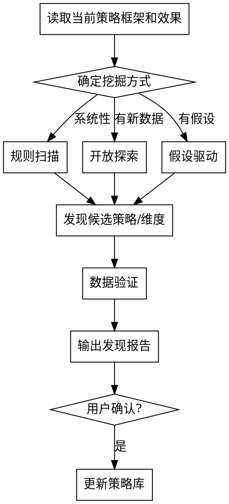

# 策略挖掘

通过大量数据和信息，探索挖掘当前策略框架之外的新策略方案。本质是策略库的**扩展器**——策略优化在已有空间内选最优，策略挖掘负责扩大这个空间。

核心原则：**挖掘发现必须有数据支撑，所有建议经用户确认后才更新策略库。**

---

## 触发条件

- 用户要求探索新策略机会
- 现有策略效果持续下滑，需要新方向
- 用户提供了新的数据或信息供分析
- 定期策略复盘时主动挖掘

---

## 前置依赖

- `{项目名}/wiki/` — 业务背景（理解目标和方向）
- `{项目名}/strategy-library/framework.md` — 当前策略框架（知道"已有空间"的边界）
- `{项目名}/strategy-library/strategies.csv` — 已有策略效果（发现规律的基础）

**如前置文件不存在，按以下顺序自动衔接调用对应 skill：**
1. 缺 wiki 文件 → 调用 `business-context-alignment` skill
2. 缺 strategy-library 文件 → 调用 `strategy-library` skill
3. 前置 skill 完成后，自动回到策略挖掘流程继续执行

对用户的体验应是连贯的对话流程，skill 之间的衔接对用户透明。

---

## 挖掘方向

| 类型 | 说明 |
|------|------|
| 新要素值 | 发现从未使用过的要素值有潜力 |
| 新细分方式 | 发现更有效的分群/分类维度 |
| 要素组合规律 | 发现特定组合效果突出但未被利用 |
| 跨场景借鉴 | 从其他业务场景迁移策略模式 |
| 反常识发现 | 数据显示"理应无效"的策略实际效果好 |
| 时序规律 | 策略效果随时间的变化模式 |
| 竞争响应模式 | 竞对动作与策略效果的关联 |
| 策略缺口 | 漏斗中无策略覆盖但可干预的环节 |
| 策略衰减预警 | 在用策略效果正在下滑 |
| 供给侧机会 | 供给充足但投放未覆盖的领域 |
| 人群生命周期 | 用户不同阶段的策略敏感度变化 |
| 外部信号关联 | 外部数据与策略效果的关联模式 |
| 组合协同/抵消 | 策略组合的非线性效果 |
| 沉默维度激活 | 从未被差异化但有区分度的维度 |

---

## 三种工作方式

### 方式一：基于规则/模板的扫描

预设挖掘模板，系统性检查各方向：

```python
# 模板示例

# 1. 未覆盖要素值扫描
# 对比 framework.md 中的可选值 vs strategies.csv 中实际出现的值

# 2. 效果下滑检测
# 按时间序列检查各策略效果趋势

# 3. 高方差维度识别
# 计算各维度下策略效果的方差，方差大 = 差异化潜力大

# 4. 未交叉组合发现
# 列出框架中可能但从未出现的要素组合
```

### 方式二：开放式数据探索

LLM 直接阅读数据，基于业务理解自主探索。适用于：
- 用户提供了新的明细数据
- 非结构化信息（行业报告、竞品动态、会议纪要）
- 数据中可能存在未预设的模式

### 方式三：假设驱动

基于业务逻辑生成假设，逐一用数据验证：

1. 生成假设列表（结合业务背景和挖掘方向）
2. 设计验证方案（需要什么数据、如何计算）
3. 执行验证
4. 输出结论（支持/不支持/数据不足）

---

## 输入

### 结构化数据
- 来源：数据库查询结果、Excel/CSV
- 通常是明细数据（比策略库的汇总粒度更细）
- 用 Python 读取分析

### 非结构化数据
- 来源：用户提供的文档、信息
- LLM 直接阅读理解，提取可验证的假设

---

## 工作流程



---

## 输出

### 发现报告

写入：`{项目名}/outputs/mining-{日期}.md`

```markdown
## 挖掘发现报告

### 发现 1：{标题}

- **类型**：{挖掘方向类型}
- **发现**：{具体发现描述}
- **数据支撑**：{支持该发现的数据证据}
- **建议动作**：
  - [ ] 新增策略条目：{具体描述}
  - [ ] 调整策略框架：{如新增维度/值}
- **预估影响**：{如果采纳，预期对目标指标的影响}
- **验证方式**：{建议如何进一步验证}
```

### 策略库更新（用户确认后）

- **新策略建议** → 写入 strategies.csv（标注为"拟合"，待验证）
- **策略框架调整** → 更新 framework.md（如新增要素维度或值）

---

## 铁律

1. **数据支撑**：每个发现必须有数据证据，不凭空推测
2. **用户确认**：所有发现经用户确认后才更新策略库/框架
3. **三种方式互补**：规则扫描保证覆盖面，开放探索保证深度，假设验证保证严谨性
4. **不硬编码**：挖掘模板引用 framework.md 中的维度，不写死具体业务词汇
